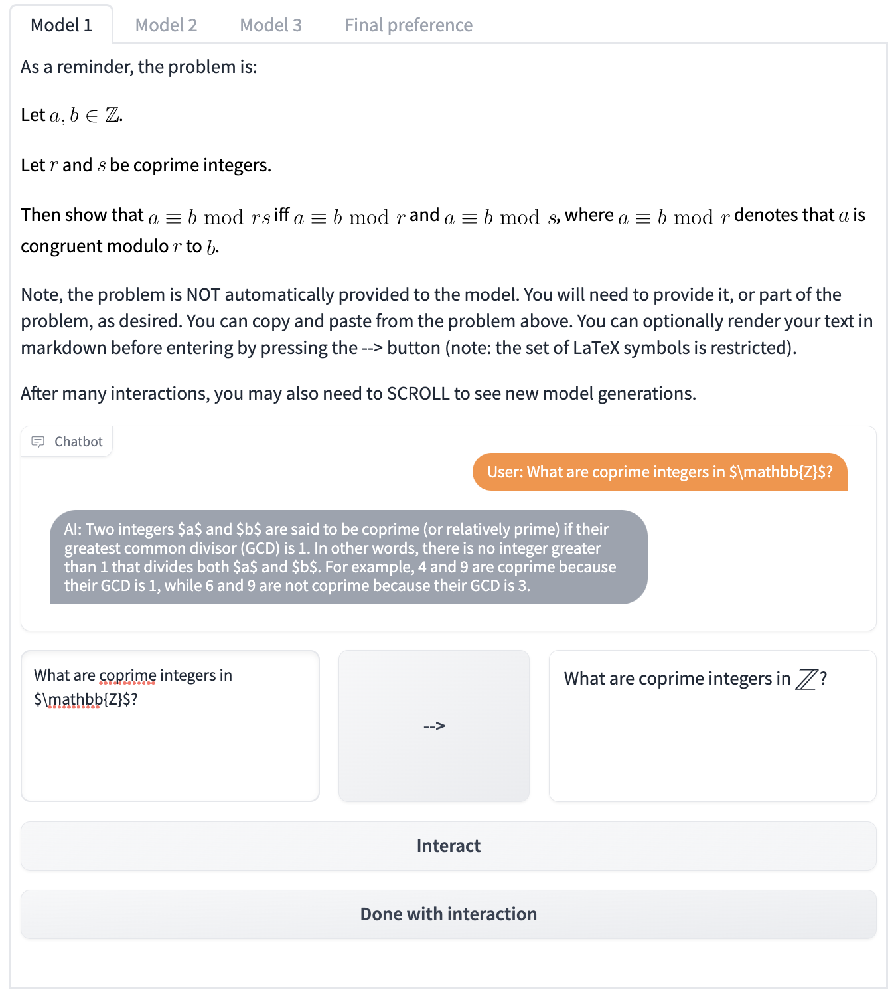

# CheckMate: A Prototype Adaptable Platform for Interactive Comparative Evaluation of LLMs 

We include code for our protoype interactive LLM evaluation platform, CheckMate, as introduced in our [PNAS paper](https://www.pnas.org/doi/10.1073/pnas.2318124121). 

If you have any questions or challenges, please feel free to post a GitHub Issue! 



We include an overview of how to adapt the platform for your own tasks in the User Guide of our [working paper](https://arxiv.org/abs/2306.01694).

The data we have already collected, as part of MathConverse, is posted in ``data/mathconverse_parsed_interactions.csv``. Columns are as follows: 
* model: name of the model the user was interacting with. note, participants did not know model identity when interacting.
* human_interactions: queries provided by the human during the interaction trace. each entry in the list was an interaction in the same interaction trace.
* model_responses: the model's response associated with each query. 
* correctness_ratings: participants' ratings of mathematical correctness for each model response.
* helpfulness_ratings: participants' ratings of perceived helpfulness for each model response.
* solo_solve: the participants' self-declared confidence in their ability to solve the problem on their own in advance. MISSING if the participant did not provide.
* problem_name: name of the problem interacting with (see data/ for all problems). 
* selected_topic: topic the participant selected to interact with. 
* uid: a unique, randomly generated id to associate with that participant's round of interactions.
* time_taken: time (in sec) spent by the user in total on the model interactions and ratings.
* mth_bkgrd: self-declared level of mathematical experience.
* ai_play_bkgrd: self-declared amount of experience interacting with AI systems prior to participating in the survey.
* interaction_set_idx: order of the set of three interactions that the participant was undertaking (zero-indexed; e.g., if this is 1, then this is the second round of three model ratings the participant is providing). 
* final_prefs: user-provided preferences over the models. MISSING if incomplete or not provided.

NEW!!! We have also uploaded an annotated taxonomy of user queries at ``data/annotated_taxonomy.csv``

We will provide a further processing script shortly. ``questions_to_ask.txt`` are a set of pre-registered questions that we wanted to ask of the data. Questions were written prior to any data collection; these were last updated on April 6, 2023.

## Launching the server
At present, the CheckMate code is seeded with the interface to run our mathematics evaluation. To start the code, you should provide your own API key in ``model_generate.py``. You can launch the survey by running: ``gradio experiment.py`` assuming that you have installed [gradio](https://gradio.app/). We used gradio version 3.19.0 but later versions should also work.

## Contact
If you have any questions, please do not hesitate to add as an Issue to our repo, or reach out to kmc61@cam.ac.uk and/or qj213@cam.ac.uk.

## Citation
If you use our code and/or data, please consider citing us at: 
```
@article{collinsJiang2023interactiveMathEval,
author = {Katherine M. Collins  and Albert Q. Jiang  and Simon Frieder  and Lionel Wong  and Miri Zilka  and Umang Bhatt  and Thomas Lukasiewicz  and Yuhuai Wu  and Joshua B. Tenenbaum  and William Hart  and Timothy Gowers  and Wenda Li  and Adrian Weller  and Mateja Jamnik },
title = {Evaluating language models for mathematics through interactions},
journal = {Proceedings of the National Academy of Sciences},
volume = {121},
number = {24},
pages = {e2318124121},
year = {2024},
doi = {10.1073/pnas.2318124121},
URL = {https://www.pnas.org/doi/abs/10.1073/pnas.2318124121},
eprint = {https://www.pnas.org/doi/pdf/10.1073/pnas.2318124121},
abstract = {There is much excitement about the opportunity to harness the power of large language models (LLMs) when building problem-solving assistants. However, the standard methodology of evaluating LLMs relies on static pairs of inputs and outputs; this is insufficient for making an informed decision about which LLMs are best to use in an interactive setting, and how that varies by setting. Static assessment therefore limits how we understand language model capabilities. We introduce CheckMate, an adaptable prototype platform for humans to interact with and evaluate LLMs. We conduct a study with CheckMate to evaluate three language models (InstructGPT, ChatGPT, and GPT-4) as assistants in proving undergraduate-level mathematics, with a mixed cohort of participants from undergraduate students to professors of mathematics. We release the resulting interaction and rating dataset, MathConverse. By analyzing MathConverse, we derive a taxonomy of human query behaviors and uncover that despite a generally positive correlation, there are notable instances of divergence between correctness and perceived helpfulness in LLM generations, among other findings. Further, we garner a more granular understanding of GPT-4 mathematical problem-solving through a series of case studies, contributed by experienced mathematicians. We conclude with actionable takeaways for ML practitioners and mathematicians: models that communicate uncertainty, respond well to user corrections, and can provide a concise rationale for their recommendations, may constitute better assistants. Humans should inspect LLM output carefully given their current shortcomings and potential for surprising fallibility.}}
```
